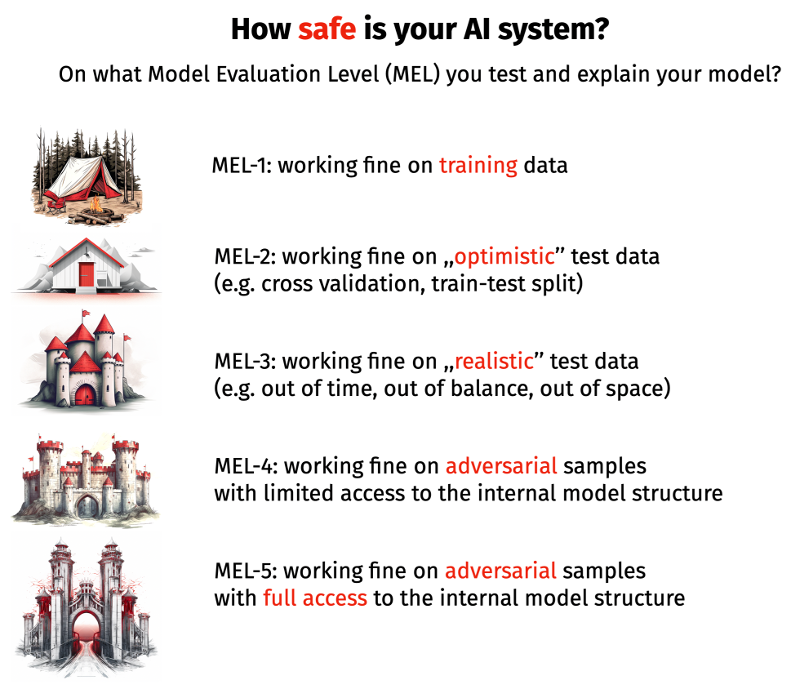

# Model Evaluation Levels

AI models are being applied to more and more important decisions, thus ensuring the reliability and trustworthiness of AI models stands as a critical endeavor. Model validation---an essential step in this process---serves as the gatekeeper between well performing and faulty model.

AI models are created to automate human behavior, and just as there are no flawless human decisions, there will be no flawless model decisions. Thus, the goal of validation is not to eliminate all errors, but to identify situations in which model errors can be eliminated.

When evaluating a model, both the evaluation criterion and the selection of the data sample to assess the quality of the model are important. In this section, we will look at the issue of data selection. 

Below we describe the five levels of model evaluation. A concept that will accompany us throughout the book are strategies to identify model weaknesses that can be fixed. Typically, this means better model behavior in areas of low data density or outside data manifold.

A diagram of the five levels of model evaluation is shown in Figure 1. 

**Model Evaluation Level 1** - for model evaluation we use the same data on which we trained the model. This is a common practice in modelling based on linear models or other models where we have strong assumptions about the mechanism generating the data and the representativeness of the sample. For linear models, evaluation can be based on $R^2$ or p-values for the significance of the coefficients. Out of all the floors, this is the most optimistic evaluation of the model. In predictive applications it is unlikely to be used and the vague word ,,overfitting'' is given as an argument.

**Model Evaluation Level 2** - to evaluate the model, we use a separate data set with a distribution similar to the training data. The most common scenario is to randomly divide the data into two parts training and testing. Sometimes used in more sophisticated variants such as cross-validation or an out-of-bag data for bootstrap sampling. The characteristic of this evaluation is that the distribution of training and test data is the same, which corresponds to the assumption that the reality in which the model will operate is not different from the reality in which the model was built. This assumption definitely simplifies model validation, although covid pandemic or wars  show that future data can differ from past data.  

**Model Evaluation Level 3** - to evaluate the model, disjoint data is used for training and testing. If the data contains a timestamp, the disjointness may mean using a different time range (so called out-of-time validation). If the data contains a geographic tag, validation may mean using a different region (out-of-region validation). Virtually any attribute can be used to define a test sample, usually this is done to test for generalizability. For data collected from different devices, out-of-device validation can be considered and so on.
This testing scheme is used by audit teams in (for example) financial institutions, especially for large-scale, high impact models (e.g., credit scoring models).

**Model Evaluation Level 4** - no more indulging, it is time to actively look for situations in which the model does not work. There are situations in which users of the model may want to adversarially influence the model's decisions. For example, for an insurance pricing model, the user is tempted to manipulate certain parameters so as to evaluate the price of the premium. Parameters such as mileage, a statement about the number of drivers or being abroad may be given incorrectly by the user if he or she thinks they will significantly reduce the price of the premium. Another example is models that detect hate speech in online forums, users who want to post offensive comments will actively test scenarios in which the models do not work. In these situations, the adversary does not know the structure of the model, and can only reflect it and thus look for model vulnerabilities.

**Model Evaluation Level 5** - In a more pessimistic scenario, the adversary has full access to the model. Whether it has been stolen or the model is publicly available is of little relevance. Analysis at this level allows tracking decision paths, calculating and using gradients. An example is the use of the LLAMA 2 language model, which is publicly available, in an AI system.

