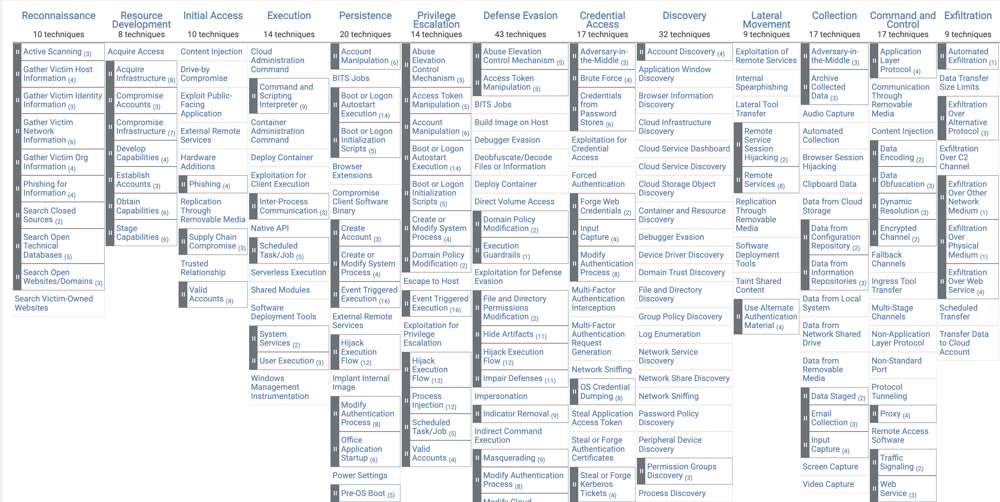
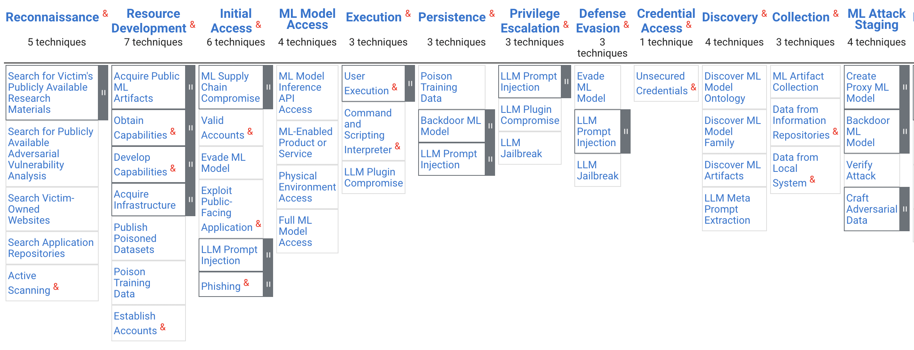

# MITRE ATT&CK

Inspirations for adversarial analysis of ML models can be borrowed from concepts proposed in cyber security. One such remarkable concept is the ATT&CK matrix maintained by MITRE corporations.

MITRE was formed in 1958 as a military think tank to advance national security. Now it is ,,applying systems thinking to national challenges in defense, cybersecurity, healthcare, homeland security, and transportation. Solving problems for a safer world'' (a quote from their official profile). MITRE has a number of ambitious projects underway, perhaps the best known of which is the MITRE ATT&CK framework https://attack.mitre.org/.

The ATT&CK framework [@mitre-att] is a curated publicly available knowledge base of various cyber adversary tactics and techniques that can be used across the entire attack lifecycle. It takes the perspective of the adversary collecting and cataloging the various tactics, techniques, and procedures (TTPs) used in cyber intrusions, thereby offering defenders a detailed insight into potential attack methods and aiding in the development of more robust defense strategies.

{#fig:mitre}

First, let's familiarise with the nomenclature used in ATT&CK framework (Adversarial Tactics, Techniques, and Common Knowledge). 

## Tactics

A **tactic** refers to a high-level objective or goal that an adversary aims to achieve during a cyber attack. It represents the overarching category of activities or actions employed by attackers to accomplish their malicious objectives within a network or system. 

There are 12 tactics defined within the ATT&CK framework, each representing a distinct phase or goal in the cyber attack lifecycle (these are columns in the matrix presented in Figure [@fig:mitre]):

- **Initial Access:** This tactic involves the methods an attacker uses to gain initial entry into a system or network environment.
- **Execution:** Tactics related to techniques used to run malicious code or commands on a victim's system.
- **Persistence:** Techniques employed by attackers to maintain their foothold within a compromised system or network, ensuring continued access even after initial access has been achieved.
- **Privilege Escalation:** Methods used to obtain higher levels of access or control within a system, moving from lower-privileged accounts to higher-privileged ones.
- **Defense Evasion:** Tactics focused on techniques used by attackers to avoid detection or thwart defensive measures implemented by security solutions.
- **Credential Access:** Techniques employed to obtain account credentials or authentication tokens, which can be used to gain unauthorized access to systems or resources.
- **Discovery:** Tactics related to an attacker's efforts to gather information about a target network or system, including identifying assets, users, and configurations.
- **Lateral Movement:** Techniques used by attackers to move through a network, exploring and accessing different systems or resources beyond the initially compromised system.
- **Collection:** Tactics involving the gathering or exfiltration of data or sensitive information from the compromised environment.
- **Exfiltration:** Techniques used to transfer stolen data or information out of the victim's network to an external location controlled by the attacker.
- **Impact:** Tactics focused on actions that cause damage, disruption, or other negative effects on the target system or organization.

## Techniques

While **tactique** address the question *Why* is the objective of the adversary action, the *What* question is addressed by **techniques**. More formally a technique refers to a specific method, approach, or procedure used by adversaries to accomplish a particular objective within a given tactic during a cyber attack.

There is a (growing) number of techniques for each tactic. For example, the techniques listed under the "Collection" tactic represent specific methods or procedures used by attackers to gather or harvest data from targeted systems or networks during a cyber intrusion. These techniques help adversaries achieve their goal of acquiring sensitive information or valuable data from compromised environments. Some techniques listed for the tactic "Collection" include Audio Capture, Clipboard data, Screen Capture and Email collection. 

For each technique, the ATT&CK matrix provides examples of procedures, mitigation strategies and detection techniques. See page https://attack.mitre.org/techniques/T1123/ for an description for the Audio Capture technique.

## Procedures

While **tactiques** address the question *Why*,  **techniques** address the question *What* then **procedures** are examples of *How*.
Procedures are descriptions of the steps necessary to implement the technique to perform the technique.

## ATT&CK for AI systems

The ATT&CK matrix was developed for attacks on IT infrastructure and applies to cyber security in the classical sense. However, due to its popularity, work is underway to adapt this approach to security analysis of AI systems. An example of the solution being developed by MITRE is the ATLAS matrix [@atlas-att], [@atlas-att2].

{#fig:mitreatlas}

## Pros and cons

The ATT&CK matrix was designed for AI systems. It can be useful as a reference for machine learning-based systems, but it's a risky interpolation. From the perspective of AI systems, the ATT&CK matrix offers some unique pros and a new perspective, but it also has some drawbacks or shortcomings. Here is a subjective selection of one and the other.

The undoubted advantage is the attacker's  perspective. The matrix resembles an hacker playbook, but at the same time allows the security  team to check if some security problems are missed or not. 

Second advantage is the standardized language, the framework provides a standardized terminology and taxonomy for cybersecurity professionals, allowing them to communicate more effectively about threats, tactics, and techniques used by adversaries.

Not to be forgotten the huge community support. New threads needs to be identified quickly and the collaboration among cybersecurity professionals and organizations, allows to stay updated with evolving threats and defensive strategies.

And since AI systems are parts of IT systems ATLAS and ATT&CK align new AI related threads with known operating schemes. This facilitates the synchronization of the team working on the security of AI models as well as IT infrastructure

With the huge advantages of the ATT&CK matrix, it is worth keeping in mind the potential weaknesses. 
The core element of this framework is a list of 12 tactics that describe successive processes for escalating access and control over an IT system. In the case of classic systems in which the ultimate success is often to gain control on the system, this approach makes sense and is very natural. In the case of AI systems, root access to bash the main server is not the ultimate goal and the escalation of access to the model itself also has a different flow. So be careful since familiar paths and a mindset that has proven itself in IT security does not remove new risks and new techniques for attacking AI systems from the horizon.

Also the ATT&CK matrix provides detailed descriptions of tactics and techniques but may lack the context of specific environments or industries, requiring customization for individual organizational needs. In the case of AI systems that are often tailored to the modality being analyzed (text, image, audio) or application (finance, medicine), the devil may be in the details.

ATT&CK primarily focuses on cataloging known techniques used by adversaries. It might not cover novel or emerging attack methods immediately, leaving a gap in addressing new threats. And in the case of AI systems safety, which is a very young discipline, new problems and attack ideas emerge very quickly.

