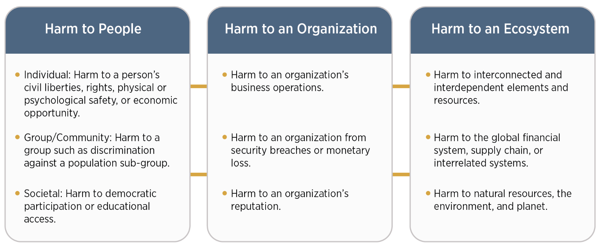
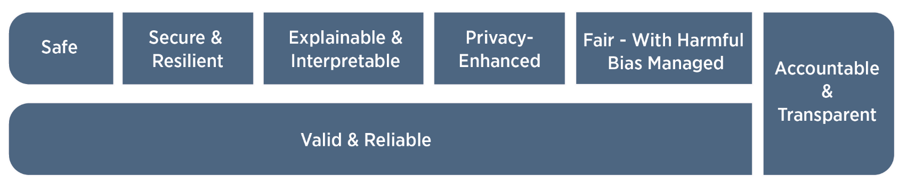
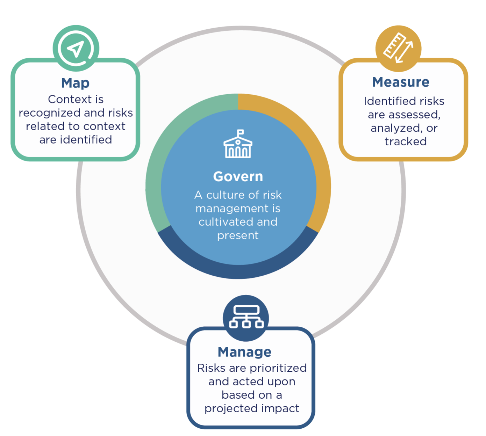
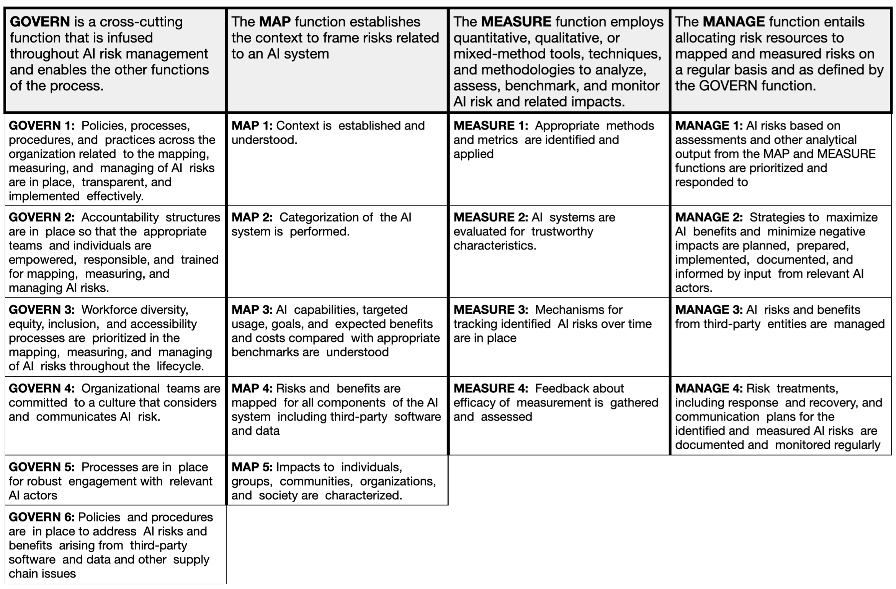

# NIST AI Risk Management Framework (AI RMF)

[The National Institute of Standards and Technology (NIST)](https://nist.gov/) was founded in 1901 and is now part of the U.S. Department of Commerce. NIST mission is to promote U.S. innovation and industrial competitiveness by advancing measurement science, standards, and technology in ways that enhance economic security and improve our quality of life.

In collaboration with the private and public sectors, NIST has developed a framework to better manage risks to individuals, organizations, and society associated with artificial intelligence (AI). The NIST AI Risk Management Framework (AI RMF) 
it is designed for voluntary adoption, aiming to enhance trustworthiness of AI solutions. First version of this framework was released on January 26, 2023. Two months later, on March 30, NIST launched the [Trustworthy and Responsible AI Resource Center](https://airc.nist.gov/Home), which will facilitate implementation of, and international alignment with, the AI RMF.

A key starting point for the NIST RMF [@rmf_nist_2023] is the observation that the risks associated with systems using ML and AI components are different from those for classical IT systems. Examples of these differences are numerous, such as the adaptive nature of ML modules that adjust to training data that may change over time, the black box nature of many ML/AI systems, the multiplicity of applications for ML/AI modules that may have been trained on non-representative data. For this reason, although there are many other tools for managing risks in AI systems, a new standard for managing risks in AI-based systems is needed.

## Risks

In the context of the AI RMF, risk refers to *the composite measure of an event’s probability of occurring and the magnitude or degree of the consequences of the corresponding event*.

AI risk management offers a path to minimize potential negative impacts of AI systems,
such as threats to civil liberties and rights, while also providing opportunities to maximize positive impacts. Addressing, documenting, and managing AI risks and potential negative impacts effectively can lead to more trustworthy AI systems.

## Characteristics of trustworthy AI systems

A comprehensive approach to risk management calls for balancing tradeoffs
among the trustworthiness characteristics. 

### Valid and Reliable

**Validation** is the "confirmation, through the provision of objective evidence, that the requirements for a specific intended use or application have been fulfilled" (ISO
9000:2015)

**Reliability** is defined in the same standard as the "ability of an item to perform as required, without failure, for a given time interval, under given conditions" (ISO/IEC TS
5723:2022).

**Accuracy** is the "closeness of results of observations, computations, or estimates to the true values or the values accepted as being true." (ISO/IEC TS 5723:2022)

**Robustness or generalizability** is defined as the "ability of a system to maintain its level of performance under a variety of circumstances" (ISO/IEC TS 5723:2022)

### Safe

**Safe** AI systems should "not under defined conditions, lead to a state in which human life, health, property, or the environment is endangered" (ISO/IEC TS 5723:2022).

**Resilient** system can withstand unexpected adverse events or unexpected changes in their environment or use – or if they can maintain their functions and structure in the face of internal and external change and degrade safely and gracefully when this is necessary (ISO/IEC TS 5723:2022).

**Secure** AI system can maintain confidentiality, integrity, and availability through protection mechanisms that prevent unauthorized access and us.

### Accountable and Transparent

**Transparency** reflects the extent to which information about an AI system and its outputs is available to individuals interacting with such a system – regardless of whether they are even aware that they are doing so.

**Accountability** presupposes transparency.

### Explainable and Interpretable

**Explainability** refers to a representation of the mechanisms underlying AI systems' operation, whereas **interpretability** refers to the meaning of AI systems' output in the context of their designed functional purposes.

Transparency, explainability, and interpretability are distinct characteristics that support each other. **Transparency** can answer the question of "what happened" in the system. **Explainability** can answer the question of "how" a decision was made in the system. **Interpretability** can answer the question of "why" a decision was made by the system and its meaning or context to the user.

### Privacy-Enhanced

**Privacy** refers to the norms and practices that help to safeguard human autonomy, identity, and dignity. These norms and practices typically address freedom from intrusion, limiting observation, or individuals' agency to consent to disclosure or control of facets of their identities (e.g., body, data, reputation).

### Fair – with Harmful Bias Managed

**Fairness** in AI includes concerns for equality and equity by addressing issues such as harmful bias and discrimination. Standards of fairness can be complex and difficult to define because perceptions of fairness differ among cultures and may shift depending on application.

**Bias** is broader than demographic balance and data representativeness. NIST has identified three major categories of AI bias to be considered and managed: systemic, computational and statistical, and human-cognitive.

## AI RMF Core

### Functions

The actions that can be taken in risk management are grouped into categories and subcategories. These in turn are grouped into four overarching functions in risk management, these are Govern, Map, Measure and Manage.

Risk management is an ongoing process that requires taking into account different perspectives. These four functions correspond to the main perspectives that need to be considered throughout the life cycle of an AI system.

### Cartegories

