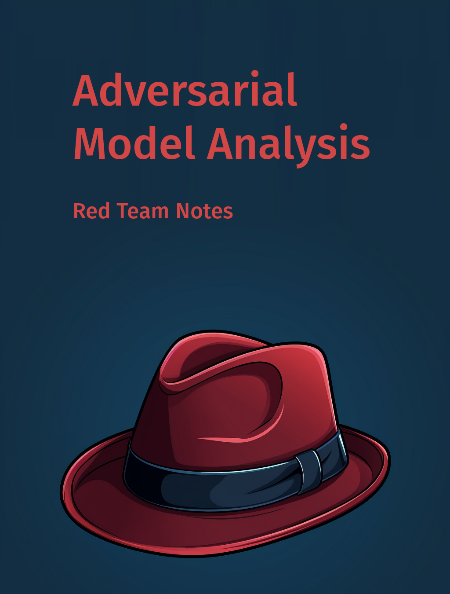

--- 
title: "Adversarial Model Analysis"
author: "Przemysław Biecek"
date: "`r Sys.Date()`"
output: pdf_document
csl: ieee.csl
link-citations: yes
colorlinks: yes
lot: no
lof: no
site: bookdown::bookdown_site
description: Red Team Notes 
graphics: yes
cover-image: images/cover.png
bibliography:
- book.bib
- packages.bib
---

```{r setup, include=FALSE}
options(
  htmltools.dir.version = FALSE, formatR.indent = 2, width = 55, digits = 4
)
output <- knitr::opts_knit$get("rmarkdown.pandoc.to")
is.html = !is.null(output) && output == "html"
```

# Introduction {-}

```{r cover, cache=FALSE, out.width="700", fig.align="center", echo=FALSE}

```


The explosion of interest in machine learning coupled with the increasing availability of large amounts of data and tools for simple development of models has quickly led to an avalanche of examples of hurtful, unsafe or unfair decisions made by automated systems.

The response to examples of decisions hurting citizens is a growing number of regulations. The AI act [@AI-Act] discussed for several years in the European Union, President Biden's recently issued Executive Order [@Executive-Order] are just two examples of the growing number of recommendations reiterating over and over that safe models must be created.

And with lines of companies eager to sell audits of AI systems (arguably more lucrative than financial audits), and a crowd of lawyers trying to embrace the nomenclature used in the emerging regulations on the table, an open question remains - what technical tools do we have available to develop secure AI systems.

After all, it's not that data scientists (the sexiest job of the 21st Century) are maliciously creating poorly performing models. Nor is it the case that data-collecting companies are maliciously sewing biases into the data. Nor is it that model-training tools bury unwanted artifacts in models.
The truth is that for the past decades we have been focused on developing model building tools virtually ignoring the need for in-depth verification.

In this book, you will find examples of techniques that can help to create safe models. However, developing safety of a model requires a completely new mind-set. Instead of chasing performance metrics by using the strangest tricks to bump up performance on the fifth significant digit this time, one must learn to look for weaknesses in models. Spot them and fix it and iterate until no weaknesses can be found.

The area of model analysis is a new topic that will rapidly expand in the years to come. Certainly many techniques not described in this book are already or will be created. If you know such techniques then please contact me, I will try to **add them to this living book**.

## Acknowledgments {-}

This book is a continuation of the *Explanatory Model Analysis* (EMA) book [@biecek_burzykowski_2021]. In EMA, we showed how to apply XAI techniques to better understand how the model works. In this book, we show how to use the available techniques to find potentially problematic situations where the model is not working.

Cover and chapter graphics created with [MidJourney](https://www.midjourney.com/).


\mainmatter

